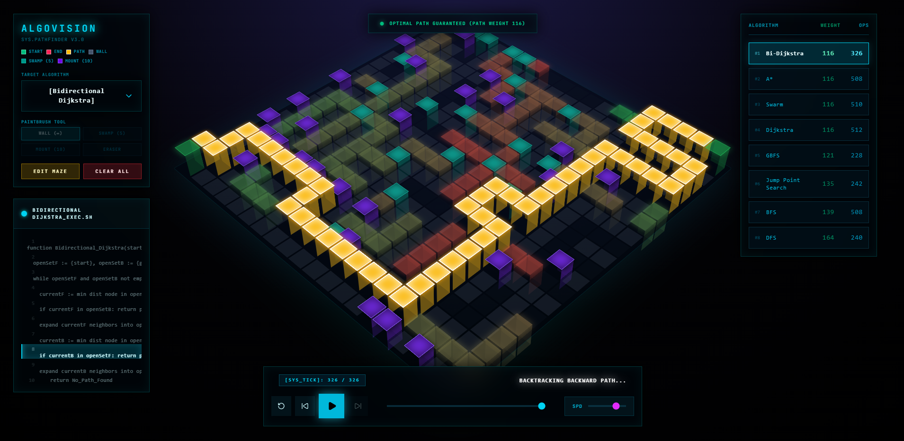

<div align="center">
  <h1>AlgoVisualizer</h1>
  <p>An interactive, high-performance, 3D isometric pathfinding and maze generation visualizer built with React.</p>

  <!-- Placeholder for the main screenshot -->
  
</div>

<br/>

## 🌟 Overview

AlgoVisualizer is a web-based educational tool designed to help developers and students understand how complex pathfinding algorithms and maze generators operate in real-time. By projecting a standard 2D grid into a hardware-accelerated isometric 3D space, the application visually demonstrates algorithm spread, node evaluation, and dynamic cost avoidance.

Users can draw obstacles, place varying terrain weights (Swamps and Mountains), instantly generate complex mazes, and race different algorithms head-to-head on a live tracking leaderboard.

## 🚀 Key Features

### 🧩 Pathfinding Algorithms
Watch as different algorithms evaluate nodes and compete to find the optimal path.
- **Dijkstra's Algorithm**: The father of pathfinding. Guarantees the shortest path.
- **A* Search (A-Star)**: Uses a heuristic to heavily optimize Dijkstra's, making it one of the most efficient pathfinders.
- **Breadth-First Search (BFS)**: Unweighted algorithm that radiates outward. Guarantees the shortest path on unweighted grids.
- **Depth-First Search (DFS)**: Unweighted algorithm that plunges as deep as possible before backtracking. Rarely optimal!
- **Greedy Best-First Search**: Highly heuristic-driven. Extremely fast but often suboptimal.
- **Bidirectional Dijkstra**: Spawns two simultaneous searches from the Start and End nodes until they meet in the middle.
- **Jump Point Search (JPS)**: A highly optimized version of A* for uniform cost grids that skips symmetric paths by jumping in straight lines.
- **Swarm Algorithm**: A custom hybrid algorithm combining A* heuristics with randomized local scatter.

### 🏗️ Maze & Map Generation
Instantly create complex environments to test the algorithms.
- **Recursive Backtracker**: Generates a perfect maze with long, winding corridors and zero loops.
- **Kruskal's Algorithm**: Generates a heavily branched maze with many short dead ends.
- **Recursive Division**: Simulates building walls to divide open spaces into a fractal-like grid.
- **Cellular Automata**: Simulates natural cave systems using Conway's Game of Life mechanics.

### 🏔️ Dynamic Weighted Terrain
Unlike basic visualizers that only support impassable walls, AlgoVisualizer supports weighted terrain:
- **Swamps (Weight 5)**: Algorithms will actively try to path around swamps unless cutting through is strictly shorter.
- **Mountains (Weight 10)**: Heavy cost barriers. Only the most desperate algorithms will attempt to cross these.
- **Walls (Weight ∞)**: Impassable barriers.

### 🏆 Live Leaderboard & Timeline
- **Leaderboard Tracker**: Tracks the total operations (Ops) and final path Weight of each algorithm so you can objectively compare their efficiency.
- **Optimal Guarantee Badge**: The app runs a background Dijkstra check to verify if the path your chosen algorithm found is truly the mathematical optimal.
- **Timeline Scrubbing**: Pause the algorithm midway and scrub forwards or backwards in time to inspect individual node evaluations step-by-step.

## 💻 Tech Stack

- **Framework:** React 19 + TypeScript
- **Build Tool:** Vite
- **Styling:** Tailwind CSS v4
- **Animation:** Framer Motion (for fluid HUD transitions and dropdowns)
- **Icons:** Lucide React

## 🛠️ Installation & Setup

1. **Clone the repository:**
   ```bash
   git clone https://github.com/your-username/algo-visualizer.git
   cd algo-visualizer
   ```

2. **Install dependencies:**
   ```bash
   npm install
   ```

3. **Start the development server:**
   ```bash
   npm run dev
   ```

4. **Build for production:**
   ```bash
   npm run build
   ```

## 🤝 Contributing
Contributions, issues, and feature requests are always welcome! Feel free to check the issues page if you want to contribute.
